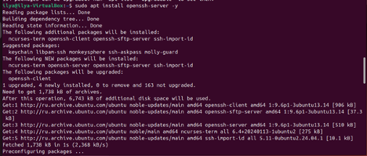
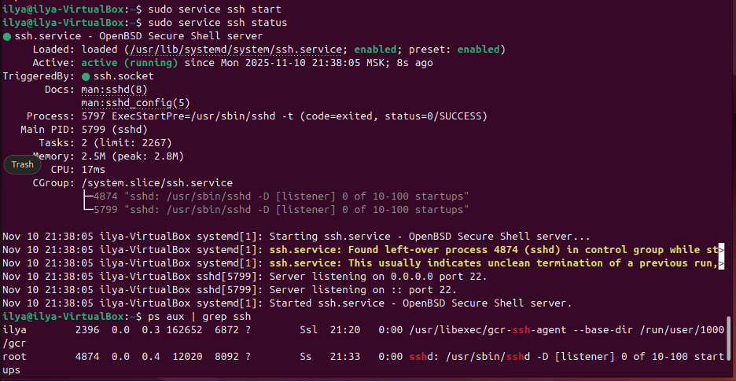
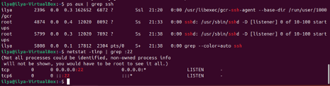
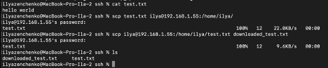
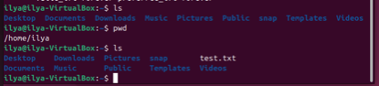
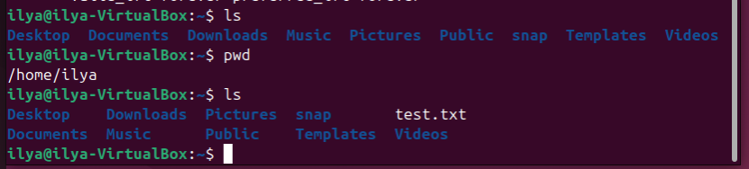
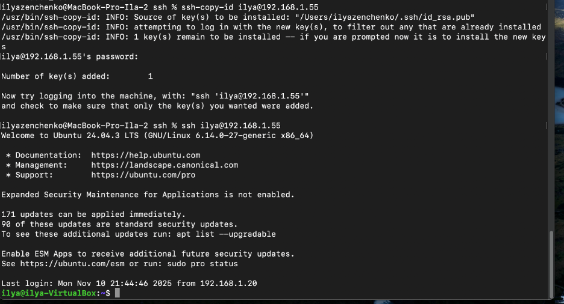

# netology-prog-eng-ssh

1.1 Установка openssh-server

1.2 Запуск и проверка

 
2 Подключение с локальной машины на виртуальную

3.1 Копирование файлов – локальная машина
 

3.2 Копирование файлов – виртуальная машина
 

 
4. Добавление ключей на виртуальную машину (уже были локально), проверка

